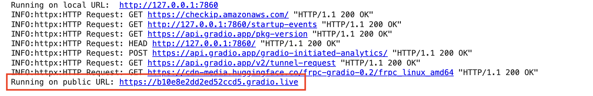

# MusicGen-Gradio-Demo
A jupyter notebook demo for MusicGen, a simple and controllable model for music generation 

## How to start making AI music with MusicGen & Gradio on Google Colab

- Open the Jupyter notebook in Google Colab, you can use this button
   
   <a href="https://colab.research.google.com/github/LeandroBerlin/MusicGen-Gradio-Demo/blob/main/MusicGen_Gradio_Demo_v1_2_0.ipynb" target="_parent"></a>

### Fast way
- In Colab menu choose "Runtime > Run all"

### Step-by-step
- Execute the first cell to install [Audiocraft](https://github.com/facebookresearch/audiocraft), this will take some time
- Execute the second cell will run the MusicGen app with Gradio in the cloud

### Access the gui
When MusicGen is deployed in the cloud you will see a message in the console:   
```"Running on public URL: in the link with a *.gradio.live url"```  

  

Click on the URL, and enjoy!
